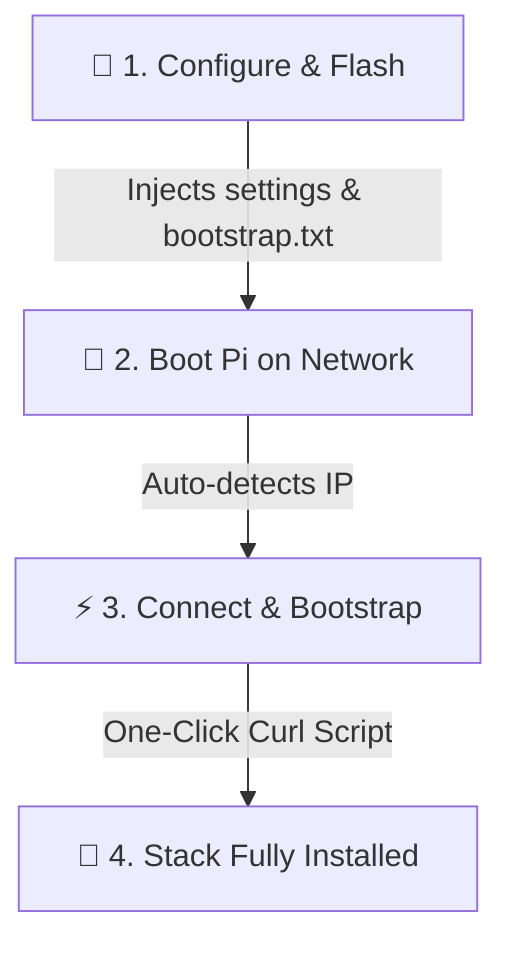

# 🚀 KACE Studio

<p align="center">
  
</p>

<p align="center">
  <a href="https://github.com/3D-uy/KACE-studio/releases/tag/v0.1.0">
    
  </a>
  <a href="https://www.python.org/">
    
  </a>
  <a href="#">
    
  </a>
  <a href="https://www.gnu.org/licenses/gpl-3.0">
    
  </a>
  <a href="https://www.klipper3d.org/">
    
  </a>
</p>

---

## 📖 About KACE Studio

**KACE Studio** is the unified desktop application used to provision and deploy KACE on Single Board Computers (SBCs) for Klipper-based 3D printers. 

Historically, configuring a new Raspberry Pi to run Klipper required juggling multiple fragmented tools: disk imagers, credentials setup files, IP subnet scanners, SSH clients, text editors, and terminal consoles. **KACE Studio** consolidates this entire onboarding pipeline into a single, guided visual desktop workflow requiring **zero CLI expertise** from the end-user.

| 📦 Project | 🎯 Purpose |
|:---|:---|
| **KACE Studio** | Desktop provisioning & deployment tool |
| **KACE** | Klipper Automatic Configuration Ecosystem |

*   ➡️ **Looking for KACE itself?** [github.com/3D-uy/kace](https://github.com/3D-uy/kace)
*   ➡️ **Looking for the desktop installer and provisioning tool?** [github.com/3D-uy/KACE-studio](https://github.com/3D-uy/KACE-studio)

Built using a hybrid desktop architecture (**Python + PyWebView + Vanilla HTML5/JS/CSS**), it provides premium aesthetics, smooth animations, and active state transitions while ensuring system safety.

---

## ✨ Key Features

### 💾 Stage A: Smart SD Card Imager
*   **📂 OS Image Caching**: Automatically downloads, validates, and decompresses (`lzma` extraction) official Raspberry Pi OS Lite images, caching them for future use.
*   **🔧 Custom Selectors**: Guided dropdowns for board selection, dashboard layout, and target architectures.
*   **🛡️ Administrative Separation**: Employs a secure partition layout. The main app runs in user-space, launching a UAC-elevated helper script (`backend/kace_writer.py`) only for block-writing physical disks.
*   **⚙️ Config Injection**: Automatically mounts boot partitions to inject Wi-Fi profiles (WPA-supplicant & modern NetworkManager connection profiles), user credentials (with cryptographically salted SHA-512 passwords), hostnames, and bootstrap settings (`kace-bootstrap.txt`).

### 🔍 Stage B: Subnet Auto-Discovery
*   **📡 Subnet Scans**: Parallelized port scanners look up Port 22 (SSH) and Port 7125 (Moonraker) to automatically find the Pi on the local network.
*   **✏️ Manual Entry Fallback**: Allows manual IP entry and probes connection ports dynamically.
*   **🏷️ Visual Badges**: Discovered endpoints show visual state indicators (`SSH Enabled`, `Moonraker`).

### 💻 Stage C: Interactive SSH Workspace
*   **🖥️ Embedded Terminal**: Integrates `xterm.js` for real-time terminal output streaming directly in the app.
*   **⚡ Automated Installer Pipeline**: Triggers remote KACE bootstrapping installer scripts via SSH to download and install Klipper, Moonraker, control interfaces (Mainsail/Fluidd), and webcam services (Crowsnest) in a single click.

---

## 🛠️ How it Works: The Onboarding Flow



1.  **Step 1: Configuration & Flashing**: The user selects their Pi model, desired dashboard UI (Mainsail, Fluidd, or both), credentials, and Wi-Fi networks. The SD card is flashed, and KACE Studio injects `kace-bootstrap.txt` along with networking files into the `/boot` partition.
2.  **Step 2: Network Discovery**: The Pi boots, automatically connects to the network using the injected details, and registers on the local subnet. KACE Studio discovers it.
3.  **Step 3: Bootstrapping**: The user connects to the device via the embedded SSH tab and clicks **"Bootstrap KACE"**, which streams the installer command directly to the host:
    ```bash
    curl -sSL https://raw.githubusercontent.com/3D-uy/KACE-studio/main/bootstrap.sh | bash -s -- --dashboard <mainsail|fluidd|both>
    ```
    This script downloads and configures Klipper (automatically patched for Python 3 compatibility on modern distros), Moonraker, control interfaces, and the Crowsnest webcam streamer, creating a functional 3D printing control hub.

---

## 🎨 Theme Support

KACE Studio features a curated aesthetic system supporting both Dark and Light themes. The selected theme state is preserved via `localStorage`.

*   **🌑 Dark Theme (Default)**: Vibrant, deep-blue palette (`#06070a` canvas) styled with subtle glassmorphic elements, Brand Orange accents (`#ff8500`), and Electric Cyan indicators (`#00e5ff`).
*   **☀️ Light Theme**: Warm cream peach palette (`#FAF6F0` main, `#FFEEDB` cards) styled with warm beige borders (`#EAD7C4`).

---

## 💻 Development & Local Setup

### 📋 Prerequisites

*   Python 3.8+
*   Windows OS (for disk flashing capabilities)

### 📥 Installing Dependencies

Install the Python requirements listed in `requirements.txt`:

```bash
pip install -r requirements.txt
```

### ⚙️ Running the Application Locally

Start the main application launcher:

```bash
python main.py
```

### 📦 Compiling to a Single Executable

To bundle the application, web assets, and background helper binaries into a single executable, compile via PyInstaller:

```bash
pyinstaller main.spec
```

The output executable will be created in `dist/KACE-studio.exe`.

---

## 📄 License

This project is licensed under the GNU General Public License v3 (GPLv3). See the [LICENSE](LICENSE) file for details.
