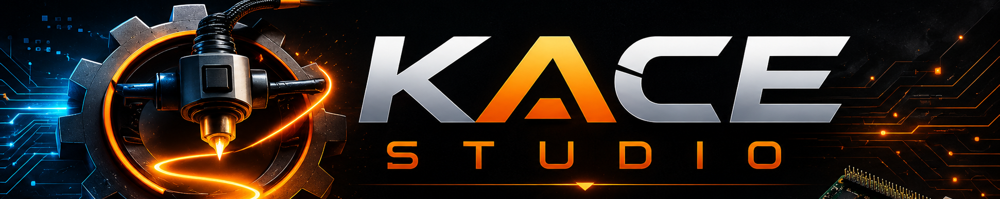

<p align="center">
  
</p>

<h1 align="center">KACE Studio</h1>

<p align="center">
  Windows provisioning and management companion for KACE
</p>

<p align="center">
  <a href="https://github.com/3D-uy/KACE-studio/actions/workflows/ci.yml"></a>
  
  
  
  <a href="LICENSE"></a>
</p>

## Overview

KACE Studio is the Windows-first desktop provisioner in the KACE ecosystem. It writes a supported Raspberry Pi operating-system image, injects first-boot configuration, discovers the new host, provides SSH/SFTP management, and launches the pinned KACE provisioning bootstrap.

Studio is not the printer-configuration generator. That responsibility belongs to [KACE](https://github.com/3D-uy/KACE), which runs on the Linux printer host after provisioning.

Writing a raw disk image is destructive. Studio includes target checks and an elevated helper boundary, but the user remains responsible for confirming the selected physical device and preserving any data on it.

## How KACE and KACE Studio work together

The two projects are independent repositories with a deliberately narrow integration boundary:

1. Studio downloads or accepts a raw Raspberry Pi image, validates it, and writes it to the selected device.
2. Studio injects network, credentials, first-boot settings, and `bootstrap.sh` onto the boot partition.
3. After the Pi boots, Studio discovers it and connects over SSH.
4. The Studio UI launches the bootstrap and follows its machine-readable stage and error markers.
5. The bootstrap installs Klipper, Moonraker, the selected web interface, optional Crowsnest support, and KACE, then launches the KACE wizard in the same SSH terminal.
6. Studio reports success only after the wizard exits successfully and the bootstrap verifies the final requested relay configuration.

`release-contract.json` is the single machine-readable source for the immutable KACE bootstrap/installer tuple and the exact packaging toolchain. Studio CI downloads that bootstrap, verifies it before the build, then inspects the finished PyInstaller archive and compares every contract-owned resource byte for byte. Source mode prefers the sibling `KACE/scripts/bootstrap.sh` checkout when both repositories share this workspace; packaged mode resolves only the `_MEIPASS` copy. Resource resolution never depends on the process working directory.

The build also emits `KACE-studio.release.json` next to the executable. It records the Studio commit and dirty state, KACE bootstrap and installed-source refs/hashes, Python/PyInstaller identity, runner image, dependency-lock/spec hashes, every bundled-resource hash, and the final EXE SHA-256. This is an external manifest so hashing it cannot change the executable it identifies. CI fixes `PYTHONHASHSEED` and the PE timestamp to the source commit, builds twice from a clean checkout, and rejects different hashes. The manifest distinguishes that same-builder proof from independent-builder reproduction, which remains false until separately demonstrated.

## Current status

KACE Studio is in active pre-1.0 development. Its backend tests run on Windows and Linux with Python 3.11 and 3.12, and CI builds a Windows executable after the tests pass. Automated tests use mocks and temporary files: they do not write to physical disks or validate a complete printer installation on real hardware.

The `main` branch and CI artifacts are development outputs, not a stable compatibility promise or a published release process.

## Features

- Guided desktop flow built with PyWebView and a local HTML/CSS/JavaScript interface.
- Official image discovery, download, checksum handling, cache reuse, and atomic `.part` publication.
- Complete ZIP and XZ extraction checks before a raw image becomes flashable.
- Custom-image support limited to uncompressed `.img` files, with optional adjacent SHA-256 sidecars. Custom pre-baked images additionally require a checksum-bound capability contract.
- Minimum raw-image plausibility and destination-capacity checks.
- Windows disk discovery with system/boot exclusions and allowed-bus filtering.
- A full selected-device identity snapshot passed to the elevated writer for revalidation.
- Reinforced confirmation for higher-risk USB HDD and SSD targets.
- UAC-elevated raw writer isolated from the normal desktop process.
- Boot-partition injection for supported prebuilt, first-boot, and cloud-init paths.
- Local network discovery for SSH and Moonraker endpoints.
- Embedded SSH terminal and SFTP file management.
- Bootstrap progress and failure reporting in the desktop UI.
- Read-only firmware progress, including KACE-owned MCU identity evidence and manual-confirmation states, instructions, native artifact download, and reconnect recovery from KACE's deployment manifest.

## Requirements

### End users

- Windows for physical raw-disk flashing.
- A supported Raspberry Pi and an SD card or other explicitly accepted removable target.
- Administrator approval when the writer helper is launched.
- Network access for image downloads, provisioning dependencies, and GitHub-hosted KACE contracts.
- A local network path from the Windows machine to the newly booted Pi.

### Contributors

- Python 3.11 or 3.12.
- Git.
- Windows for real writer validation; Linux is supported for non-destructive CI tests.
- PyInstaller when building the executable.

Docker is not required to run Studio. It is used by the KACE repository for configuration and firmware validation.

## Installation

KACE Studio does not currently document a stable binary release channel. Run it from source for development or use a Windows executable produced by a trusted CI run after verifying its provenance.

### Run from source

```powershell
git clone https://github.com/3D-uy/KACE-studio.git
Set-Location KACE-studio
py -3.12 -m venv .venv
.\.venv\Scripts\Activate.ps1
python -m pip install --upgrade pip
python -m pip install -r requirements.txt
python main.py
```

### Build the Windows executable

```powershell
python -m pip install -r requirements.txt
python -m pip install -r requirements-dev.txt
pyinstaller --clean -y main.spec
```

Before building, place the bootstrap file verified against the pinned KACE commit and SHA-256 at `bootstrap.sh`. The CI workflow performs that download and verification automatically. See [RELEASE_CHECKLIST.md](RELEASE_CHECKLIST.md) for the complete contract check.

## End-to-end workflow

1. Install or launch KACE Studio on Windows.
2. Choose the Raspberry Pi model, operating-system source, target device, network, credentials, and provisioning options.
3. Review the selected disk identity and destructive-operation warning. Higher-risk external HDD/SSD targets require reinforced confirmation.
4. Let Studio resolve a complete raw `.img`, confirm that it fits, and launch the elevated writer.
5. The writer re-queries the selected physical device and rejects changed or incomplete identity before writing.
6. Studio injects first-boot configuration and the verified bootstrap onto the new boot partition.
7. Boot the Raspberry Pi, wait for it to join the network, and discover or enter its address in Studio.
8. Connect through the embedded SSH workspace and start provisioning.
9. The bootstrap launches the interactive KACE wizard in Studio's SSH terminal after installing KACE.
10. Studio enables Finish only after the wizard exits successfully, the final relay configuration is verified, and the bootstrap reports completion. Then follow Klipper's official commissioning checks before operating the printer.

## Architecture

| Area | Responsibility |
| --- | --- |
| `main.py` | PyWebView API, desktop lifecycle, image acquisition, cache orchestration, and forwarding of KACE-owned workflow events |
| `web/` | Local user interface, read-only workflow projections, validation, terminal, and bundled front-end assets |
| `backend/imager.py` | Disk discovery, identity policy, elevated-writer invocation, and boot-partition injection |
| `backend/kace_writer.py` | UAC-elevated physical-device revalidation and raw image writing |
| `backend/discovery.py` | Local-network host and service discovery |
| `backend/ssh_client.py` | SSH terminal, SFTP operations, and size-limited deployment-manifest recovery |
| `backend/sha512_crypt.py` | Password-hash support for injected Linux account data |
| `bootstrap.sh` | Build input copied from a pinned KACE revision |
| `main.spec` | PyInstaller definition, including the verified bootstrap and web assets |
| `tests/` | Unit and regression coverage using disk, PowerShell, process, network, cache, and filesystem mocks |

The application normally runs without elevation. Only the physical writer helper crosses the administrative boundary.

## Technologies

- Python and PyWebView.
- Vanilla HTML, CSS, and JavaScript.
- xterm.js for the embedded terminal.
- Paramiko for SSH/SFTP.
- PowerShell and Win32 disk APIs for Windows imaging.
- PyInstaller for the Windows executable.
- Pytest and GitHub Actions for validation and CI.

## Testing and validation

Install both runtime and development dependencies, then run:

```powershell
python -m pip install -r requirements.txt
python -m pip install -r requirements-dev.txt
python -m pytest -v
```

The suite covers the image cache and extraction paths, cancellation cleanup, raw-image checks, disk filtering, device-identity snapshots, elevated-helper revalidation, bootstrap delivery, discovery, SSH behavior, and UI-facing backend contracts. Disk and writer tests are mocked and must never target real hardware.

For bootstrap-sensitive changes, validate both delivery modes:

- Source mode with a sibling `KACE/scripts/bootstrap.sh`.
- Packaged mode with the verified `bootstrap.sh` included by `main.spec`.

## Docker

Studio has no supported Docker runtime image because a container cannot represent its Windows desktop, UAC, and physical-disk workflow. Linux CI installs GTK/WebKit system libraries only to import and exercise non-destructive application paths.

Docker-based Klipper parser matrices and firmware builds live in the [KACE repository](https://github.com/3D-uy/KACE). They validate generated printer artifacts after Studio has provisioned the host; they do not validate the Windows writer itself.

## CI/CD

GitHub Actions currently:

- Runs the Pytest suite on Windows and Ubuntu with Python 3.11 and 3.12.
- Fetches KACE's bootstrap from a fixed commit and rejects a SHA-256 mismatch.
- Builds `KACE-studio.exe` on Windows only after the test matrix passes.
- Includes the verified `bootstrap.sh` and local web assets through `main.spec`.
- Uploads the executable as a CI artifact.

CI does not publish a release, sign the executable, or flash physical media.

## Compatibility and limits

- Physical imaging is Windows-only.
- Automated official-image paths handle the ZIP/XZ formats implemented by the acquisition pipeline.
- Manually selected custom images must already be raw `.img` files; compressed custom files are rejected before the writer.
- A custom image classified as pre-baked must have `<image>.img.kace-preflight.json`. The `kace-studio-prebaked-preflight/v1` document must bind `image_sha256` to the selected raw image and declare a supported `family`, `version`, full `source_commit`, the required systemd `services`, and provisioning `capabilities`. Missing, incompatible, or mismatched contracts stop before any block write.
- The current removable-target policy accepts supported USB, SD, and MMC paths after system/boot and identity checks. External USB HDD/SSD devices remain high-risk even with reinforced confirmation.
- Network discovery depends on local routing, firewall rules, SSH availability, and Moonraker port visibility.
- Studio can provision the dashboard choices implemented by the KACE bootstrap. Upstream images and installers can change independently.
- Automated tests do not prove electrical, storage, or printer safety on real hardware.

## Roadmap

Before 1.0, the project should prioritize signed and reproducible Windows artifacts, physical-device qualification, end-to-end provisioning evidence, explicit compatibility records, and continuous verification of the cross-repository bootstrap contract. After 1.0, work should focus on upgrade stability, diagnostics, accessibility, and broader verified platform coverage. Additional provisioning features belong in a later roadmap only when they have ownership and automated coverage.

Roadmap items are intentions, not shipped features.

## Contributing

Open an issue before making a broad workflow or writer change. Keep changes narrow, preserve the unelevated/elevated boundary, add non-destructive regression coverage, and document any change to the bootstrap markers or packaged data contract.

Issues and pull requests are managed in the [KACE Studio repository](https://github.com/3D-uy/KACE-studio).

## License

KACE Studio is licensed under the [GNU General Public License v3.0](LICENSE).
