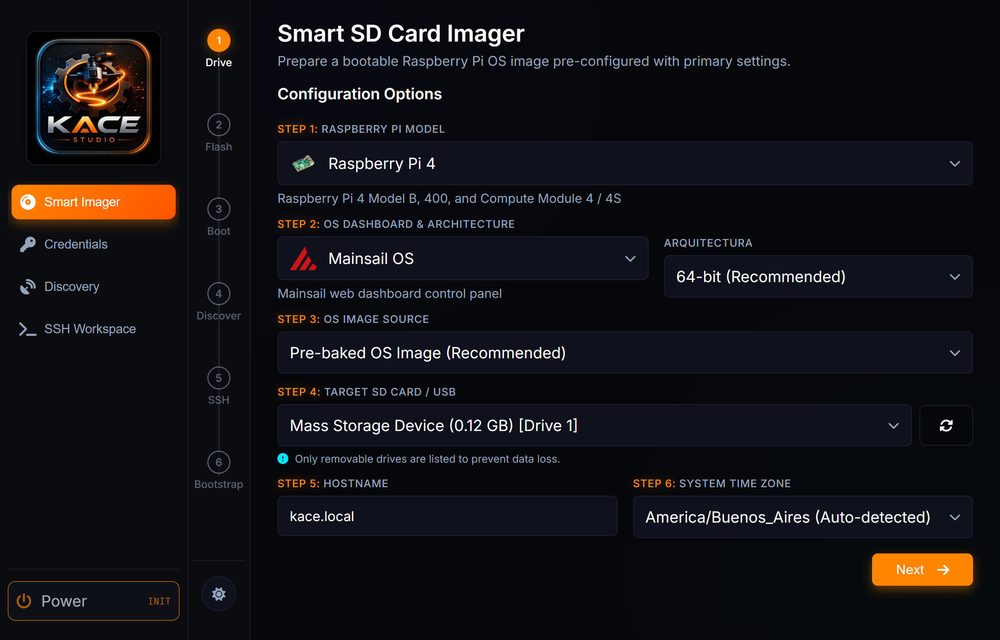
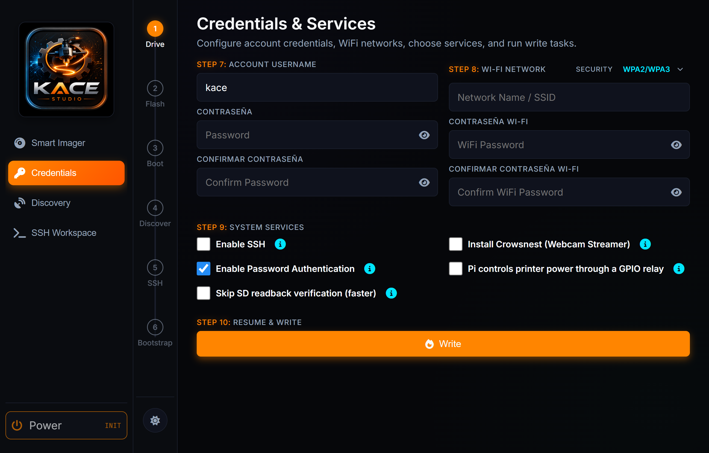

# KACE Studio

### Preparação do Raspberry Pi para o ecossistema KACE

**Prepare seu Raspberry Pi para o Klipper em um aplicativo Windows.**

[](../../release-contract.json) [](#project-status) [](#platform-and-requirements) [](../DEVELOPMENT.md) [](https://github.com/3D-uy/KACE-studio/actions/workflows/ci.yml) [](../../LICENSE) [](https://github.com/3D-uy/KACE-studio) [](https://developer.microsoft.com/en-us/microsoft-edge/webview2/) [](#kace-integration) [](../../requirements.txt)

🌐 [English](../../README.md) · [Español](../es/README.md) · [Português](README.md)

O KACE Studio orienta a escolha de uma imagem Raspberry Pi, a configuração do primeiro boot e a gravação de um cartão SD ou unidade USB. Depois que o Pi iniciar, use descoberta, SSH e SFTP para continuar a instalação com o KACE.

**O KACE Studio prepara o host; o KACE configura a impressora.**

**[⬇ Baixar para Windows x64 (ZIP)](https://github.com/3D-uy/KACE-studio/releases/download/v0.5.0-rc.3/KACE-Studio-0.5.0-rc.3-Windows-x64.zip)** · [Releases](https://github.com/3D-uy/KACE-studio/releases) · [KACE](https://github.com/3D-uy/KACE)

## ✨ O que o Studio faz

| Tarefa | No Studio |
| --- | --- |
| 💾 **Preparar o Pi** | Escolha modelo do Pi, imagem, arquitetura e dashboard Mainsail/Fluidd. |
| 🔧 **Configurar o primeiro boot** | Defina hostname, conta, rede e SSH antes de iniciar. |
| ✅ **Gravar e verificar** | Confira a SD/USB selecionada, grave a imagem, verifique e ejete com segurança. |
| 🔗 **Conectar e continuar** | Encontre o Pi, use SSH/SFTP e acompanhe o bootstrap e a instalação do KACE. |

## 🧭 Da imagem à configuração da impressora

> **Escolher hardware → Escolher imagem → Configurar primeiro boot → Gravar e verificar<br>→ Iniciar o Pi → Conectar por SSH → Continuar com o KACE**

O Imager alinha as configurações em pares e abre as opções do relé GPIO ao ativá-lo. A busca pausa quando novos dispositivos respondem. Escolha Conectar, Continuar buscando (endereços já revisados não pausam novamente) ou Parar busca. Cada período dura até dez minutos; encontrar um dispositivo não verifica uma instalação do KACE.

<a id="quick-start"></a>
<a id="download-and-install"></a>

## 🚀 Download e instalação

Requer **Windows 10/11 x64** e [Microsoft Edge WebView2 Runtime](https://developer.microsoft.com/en-us/microsoft-edge/webview2/). Se o Studio não abrir por falta do WebView2, instale o **Evergreen Standalone Installer (x64)** da Microsoft e tente novamente.

1. Abra [Releases](https://github.com/3D-uy/KACE-studio/releases) e selecione **v0.5.0-rc.3** (pre-release).
2. Em **Assets**, baixe **`KACE-Studio-0.5.0-rc.3-Windows-x64.zip`**. Os arquivos automáticos “Source code” são destinados ao desenvolvimento.
3. Clique com o botão direito no ZIP, escolha **Extrair tudo** e abra a pasta extraída.
4. Abra **`KACE-studio.exe`** com um clique duplo. Não é necessário instalar Python nem Git.
5. Se o Windows mostrar **“O Windows protegeu o computador”**, esta prerelease **não tem assinatura digital**. Primeiro confira se o ZIP veio deste repositório e se o SHA-256 corresponde ao publicado. Se corresponder e você decidir continuar, selecione **Mais informações → Executar assim mesmo**. Se essa opção não aparecer em um computador gerenciado, contate seu administrador.
6. Comece em **Smart Imager**. Conecte a SD/USB desejada e confira sua identidade antes de gravar: **a unidade selecionada será apagada**. A operação de disco solicitará autorização de administrador.

<details>
<summary>🔐 Verificar o download</summary>

Compare o resultado com o SHA-256 publicado nas notas da release e em `SHA256SUMS.txt`:

```powershell
Get-FileHash .\KACE-Studio-0.5.0-rc.3-Windows-x64.zip -Algorithm SHA256
```

</details>

## 🖼️ Conheça o Studio



*Smart Imager: seleção de hardware, imagem e unidade de destino.*



*Credentials: preparação da conta e da rede para o primeiro boot do Pi.*

Capturas reais do aplicativo Windows. Mostram a preparação, não uma gravação concluída nem uma impressora conectada.

<a id="kace-integration"></a>

## 🔗 Integração com o KACE

O Studio cuida da imagem, do primeiro boot e do acesso remoto. O [KACE](https://github.com/3D-uy/KACE/blob/main/docs/pt/README.md) cuida da configuração da impressora, dos fluxos de firmware MCU suportados, da aplicação e da verificação da instalação.

Inicie o bootstrap pelo espaço de trabalho SSH e continue com o assistente do KACE no Pi. Algumas etapas de firmware exigem ação manual; conclua a verificação do KACE antes de colocar a impressora em operação.

<a id="platform-and-requirements"></a>

## 🖥️ Hardware e requisitos

| Área | O que é necessário |
| --- | --- |
| Computador | Windows 10/11 x64 e WebView2; internet para downloads. |
| Host da impressora | Um Raspberry Pi suportado, uma SD/USB e acesso à rede local. |
| Imagens | Raspberry Pi OS Lite ou a base MainsailOS verificada; Mainsail, Fluidd ou ambos como dashboards. |
| Imagens próprias | Uma `.img` descompactada com `.sha256`; imagens próprias pré-configuradas também precisam de `.kace-attestation.json`. |

O [guia de imagens (EN)](../IMAGE_PROVISIONING.md) detalha combinações de Pi/arquitetura e requisitos de imagens próprias. Os testes de CI no Linux não implicam suporte ao desktop Linux.

<a id="project-status"></a>

## 🧪 Estado do projeto

**0.5.0-rc.3 é uma prerelease sem assinatura digital.** Testes automatizados e verificações do pacote não comprovam qualificação física do hardware. Gravação real, primeiro boot e comissionamento da impressora ainda precisam ser validados no seu equipamento.

As distribuições incluem commit de origem, checksums e evidência de reconstrução independente no Windows. Consulte política de assinatura, contratos de build, limites de recuperação e qualificação no [checklist de release (EN)](../../RELEASE_CHECKLIST.md) e no [roadmap](ROADMAP.md).

## 📚 Documentação

| Para | Consulte |
| --- | --- |
| Imagens, provisionamento e recuperação | [Guia de imagens (EN)](../IMAGE_PROVISIONING.md) |
| Arquitetura, execução pelo código e testes | [Desenvolvimento (EN)](../DEVELOPMENT.md) |
| Evidência de build, assinatura e qualificação | [Checklist de release (EN)](../../RELEASE_CHECKLIST.md) |
| Mudanças e trabalho previsto | [Changelog (EN)](../../CHANGELOG.md) · [Roadmap](ROADMAP.md) |

## 🛠️ Desenvolvimento e contribuições

Para executar pelo código, instale Git e Python **3.12** (3.11 também é suportado) e use o PowerShell:

```powershell
git clone https://github.com/3D-uy/KACE-studio.git
cd KACE-studio
py -3.12 -m venv .venv
.\.venv\Scripts\python.exe -m pip install --require-hashes -r requirements.lock
.\.venv\Scripts\python.exe main.py
```

Execute `python -m pytest -q` e `python scripts/check_portability.py` no ambiente virtual. Os testes de frontend exigem Node. Consulte o fluxo completo em [Desenvolvimento (EN)](../DEVELOPMENT.md) e relatos de vulnerabilidades em [Segurança (EN)](../../SECURITY.md).

## ❤️ Comunidade e agradecimentos

**Um agradecimento especial ao Klipper e à sua comunidade** pelo firmware, documentação e conhecimento compartilhado que tornam este ecossistema possível.

O Studio se apoia no [KACE](https://github.com/3D-uy/KACE), [Moonraker](https://moonraker.readthedocs.io/en/latest/), [Mainsail / MainsailOS](https://docs.mainsail.xyz/), [Fluidd](https://docs.fluidd.xyz/), [Raspberry Pi](https://www.raspberrypi.com/software/) e [Crowsnest](https://docs.mainsail.xyz/crowsnest/) opcional. Sua janela desktop utiliza [PyWebView](https://github.com/r0x0r/pywebview) e [WebView2](https://developer.microsoft.com/en-us/microsoft-edge/webview2/).

O KACE Studio é um projeto independente e não é oficialmente afiliado nem endossado pelo Klipper ou pelos demais projetos de terceiros mencionados aqui.

## 📜 Licença

O KACE Studio é open source sob a [GNU GPL v3](../../LICENSE).

Correções no código-fonte: redirecionamentos do Moonraker são rejeitados. Consulte os [contratos de desenvolvimento](../DEVELOPMENT.md) para operações remotas e limites de validação. O candidato para download não muda até preparar uma nova release. A descoberta exige uma sub-rede real, inequívoca e dentro do limite de 1024 endereços; nos demais casos use conexão manual. Os valores WiFi devem ser preservados pelo parser da imagem; falhas SFTP são exibidas como erros.
