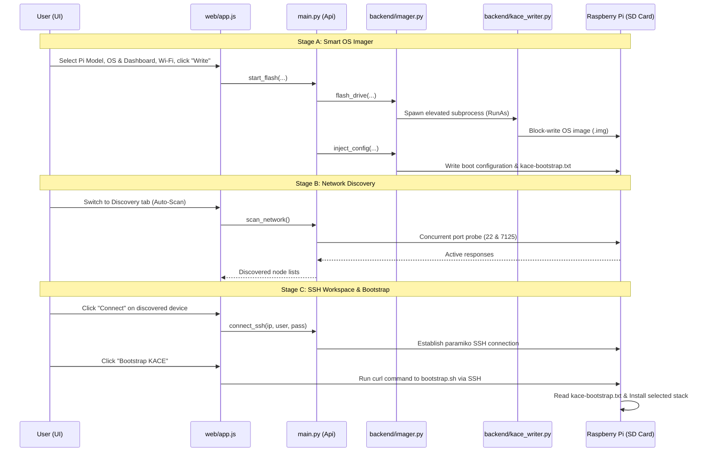

# KACE Studio Workflow Guide

This document provides a comprehensive, step-by-step breakdown of how **KACE Studio** operates across its entire lifecycle, connecting standard user interactions on the frontend to the backend code executing behind the scenes.

---

## 🗺️ High-Level Architectural Flow

KACE Studio operates as a single-window desktop application powered by **pywebview** (hosting a vanilla HTML/JS/CSS frontend in Microsoft WebView2) bridging to a **Python 3** backend sidecar. 



---

## 📦 Stage A: Smart OS Imager & Provisioning

This stage handles setting up the SD card with the target Linux OS and pre-provisioning it so it can boot, automatically connect to your Wi-Fi network, allow SSH, and store your installation preferences.

### Step 1: User Input & Form Gathering
*   **Location:** `web/index.html` and [app.js](file:///d:/Open%20World/GitHub/KACE-studio/web/app.js)
*   The user configures:
    1.  **Pi Model** (e.g. Raspberry Pi 4, Pi 5)
    2.  **OS Architecture** (32-bit vs. 64-bit)
    3.  **Dashboard UI** (`mainsail`, `fluidd`, or `both`)
    4.  **Target Storage Drive** (Removable USB/SD drives only)
    5.  **Hostname** (defaults to `kace.local`)
    6.  **System Timezone**
    7.  **SSH Credentials** (username `kace` with custom password)
    8.  **Wi-Fi SSID & Password**
    9.  **Services** (Webcam support: Crowsnest toggle)

### Step 2: Drive Discovery (Filters Out System Drives)
*   **Location:** [imager.py:list_drives](file:///d:/Open%20World/GitHub/KACE-studio/backend/imager.py#L44-L89) called by [main.py:get_drives](file:///d:/Open%20World/GitHub/KACE-studio/main.py#L48-L52)
*   To prevent users from accidentally wiping their main operating system disks, KACE Studio queries logical disks via PowerShell:
    ```powershell
    Get-Disk | Select-Object Number, FriendlyName, Size, BusType, IsSystem, IsBoot
    ```
    It filters the output and displays only drives using removable bus connections (e.g., `USB`, `SD`, `MMC`).

### Step 3: Resolving and Downloading the OS Image
*   **Location:** [main.py:_resolve_default_image](file:///d:/Open%20World/GitHub/KACE-studio/main.py#L225-L318)
*   If the user selects the default OS, KACE Studio checks for the latest Raspberry Pi OS Lite release online.
*   If no cache exists (or if it's outdated), it downloads the compressed image archive (`.xz`) using `urllib.request`.
*   It computes the SHA-256 hash to ensure download integrity and decompresses it to `.img` using Python's standard `lzma` library.

### Step 4: Elevated Block-Level Flashing (UAC Separation)
*   **Location:** [imager.py:flash_drive](file:///d:/Open%20World/GitHub/KACE-studio/backend/imager.py#L120-L228) spawning [kace_writer.py](file:///d:/Open%20World/GitHub/KACE-studio/backend/kace_writer.py)
*   To write to a raw physical drive block-by-block, administrative privileges are required.
*   The main application runs in normal user mode. When the user clicks **"Write"**, KACE Studio spawns a standalone helper process `kace_writer.py` via PowerShell with the `-Verb RunAs` flag:
    ```powershell
    Start-Process -FilePath '<python/main.exe>' -ArgumentList '--write-disk', <drive_id>, <image_path>, <progress_file> -Verb RunAs -Wait -WindowStyle Hidden
    ```
*   This triggers a Windows UAC prompt. The elevated helper runs the write sequence, posting progress increments to a temporary JSON status file. The main application polls this status file to update the flashing progress bar in the UI.

### Step 5: Configuration Injection (Post-Flash Mount)
*   **Location:** [imager.py:inject_config](file:///d:/Open%20World/GitHub/KACE-studio/backend/imager.py#L229-L376)
*   Once block-writing completes, KACE Studio mounts the FAT32 boot partition of the SD card and injects custom provisioning files:
    1.  **`ssh` and `ssh.txt`**: Empty files indicating that the SSH server daemon should start automatically on boot.
    2.  **`userconf.txt`**: Creates the system user `kace` with a cryptographically-salted SHA-512 hashed password (via [sha512_crypt.py](file:///d:/Open%20World/GitHub/KACE-studio/backend/sha512_crypt.py)).
    3.  **`wpa_supplicant.conf` & NetworkManager Connection Profile (`preconfigured-wifi.nmconnection`)**: Configures Wi-Fi connection parameters. This ensures out-of-the-box compatibility with both legacy Debian Bullseye (uses wpa_supplicant) and modern Debian Bookworm (uses NetworkManager profiles).
    4.  **`cmdline.txt`**: appends `systemd.hostname=<hostname>` to force set the system mDNS hostname.
    5.  **`custom.toml`**: Standard headless setup schema for Debian Bookworm.
    6.  **`kace-bootstrap.txt`**: **Crucial Metadata file** containing user choices for the installer stage:
        ```text
        DASHBOARD=<mainsail|fluidd|both>
        CROWSNEST=<true|false>
        TIMEZONE=<timezone>
        PI_MODEL=<pi_model>
        OS_ARCH=<os_arch>
        ```

---

## 🔍 Stage B: Subnet Network Discovery

Once the Pi is flashed, the user inserts the SD card and powers on the Pi. It boots up and connects to the network automatically using the injected Wi-Fi credentials.

### Step 6: Network Scanning & Socket Probing
*   **Location:** [discovery.py:scan_network](file:///d:/Open%20World/GitHub/KACE-studio/backend/discovery.py) called by [main.py:scan_network](file:///d:/Open%20World/GitHub/KACE-studio/main.py#L400-L404)
*   KACE Studio obtains the host computer's local IP address and computes its subnet range (e.g. `192.168.1.0/24`).
*   It spawns a Python `ThreadPoolExecutor` to probe all 254 active host IPs concurrently:
    *   **Port 22 (SSH)**: If open, it means the Pi is reachable.
    *   **Port 7125 (Moonraker)**: If open, it means the Klipper Moonraker API is already running on the node.
*   Discovered endpoints are returned to the frontend [app.js](file:///d:/Open%20World/GitHub/KACE-studio/web/app.js) and displayed as a list of devices with status badges (e.g. `SSH Enabled`, `Moonraker`).

---

## 💻 Stage C: SSH Workspace & Automating Bootstrap

After identifying the Pi's IP address in the discovery list, the user clicks **"Connect"** to initiate bootstrapping.

### Step 7: Establishing the SSH Session
*   **Location:** [ssh_client.py:SSHSession](file:///d:/Open%20World/GitHub/KACE-studio/backend/ssh_client.py#L6-L119) called by [main.py:connect_ssh](file:///d:/Open%20World/GitHub/KACE-studio/main.py#L415-L447)
*   The application prompts the user for the password configured in Stage A.
*   Using the `paramiko` library, the Python backend establishes an SSH tunnel, allocates a virtual terminal (`pty`), and spawns an interactive bash shell.
*   Data read from the remote stream is serialized and pushed to the client using pywebview's JS bridge callback:
    ```javascript
    window.writeTerminalData(data);
    ```
    This prints stdout/stderr outputs directly onto the embedded **xterm.js** console canvas in the UI.

### Step 8: Execution of `bootstrap.sh`
*   **Location:** [app.js:startBootstrap](file:///d:/Open%20World/GitHub/KACE-studio/web/app.js#L951-L983) and [bootstrap.sh](file:///d:/Open%20World/GitHub/KACE-studio/bootstrap.sh)
*   When the user clicks the primary **"Bootstrap KACE"** button in the SSH workspace tab, the app issues a single command over the active SSH terminal channel:
    ```bash
    curl -sSL https://raw.githubusercontent.com/3D-uy/KACE-studio/main/bootstrap.sh | bash -s -- --dashboard <selected_dashboard>
    ```
*   The script running on the remote Pi performs the following steps:
    1.  **Reads Injected Metadata:** It checks for the presence of `/boot/firmware/kace-bootstrap.txt` (or `/boot/kace-bootstrap.txt`). It parses variables: `DASHBOARD`, `CROWSNEST`, and `TIMEZONE`.
    2.  **Applies Timezone:** Updates the system clock configuration: `sudo timedatectl set-timezone $TIMEZONE`.
    3.  **Updates Repositories:** Runs package updates and installs baseline utilities (`git`, `curl`, `python3-pip`, `nginx`, `unzip`).
    4.  **Installs Klipper & Moonraker:** Clones the engines from official repositories and executes the official system installers (`install-octopi.sh` and `install-moonraker.sh`) to establish service dependencies.
    5.  **Downloads Selected Dashboard:** Downloads the latest release packages for the chosen client interface (Mainsail, Fluidd, or both), extracting them into `/var/www/<mainsail|fluidd>`.
    6.  **Configures Nginx Web Server:** Sets up a virtual host reverse-proxy routing requests on Port 80 to server blocks and web sockets on Port 7125 (Moonraker socket).
    7.  **Installs Crowsnest Webcam Streamer:** Clones the repository and runs the non-interactive setup *only* if the user selected webcam streaming (`CROWSNEST=true`).
*   Once completed, Nginx is restarted, and the fully-bootstrapped printer dashboard becomes accessible at `http://<pi_ip>`.
